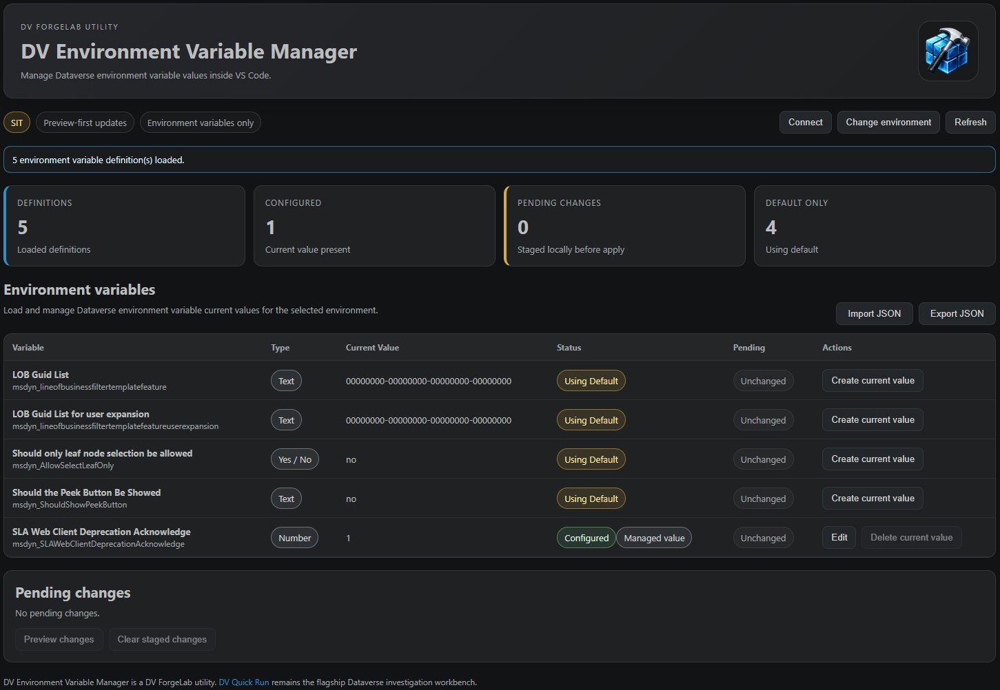

# DV Environment Variable Manager

Preview-first Dataverse environment variable value management inside VS Code.

**DV Environment Variable Manager** is a focused utility from **DV ForgeLab** for reviewing, creating, updating, removing, importing, and exporting Dataverse environment variable current values without leaving VS Code.

Built around a **preview-first workflow**, all changes are staged locally before being applied to Dataverse, helping administrators review environment configuration changes before execution.



---

## Features

### Environment Variable Visibility

* Connect to Dataverse environments using Azure CLI authentication
* Load environment variable definitions
* Load environment variable current values
* View configured and default-backed variables
* Display variable type information
* Display managed value indicators

### Definition Artifacts

* Export environment variable definitions and current values to JSON
* Import environment variable current values from JSON
* Stage imported differences locally before apply
* Skip unchanged values, missing definitions, and unsupported secret values
* Use JSON artifacts for repeatable configuration reconstruction workflows

### Preview-First Administration

* Create current values for environment variables using definition defaults
* Update existing current values
* Remove current values where permitted by Dataverse
* Stage changes locally before execution
* Review pending changes
* Preview mutations before applying

### Validation & Safety

* Production environment visual indicators
* Managed value protection
* Number validation
* Yes / No value validation
* JSON validation
* Preview-before-apply workflow

### Operational Awareness

* Configured vs Using Default status indicators
* Environment-aware DEV / TEST / PROD visual cues
* Refresh and reload environment variable state
* Managed solution awareness
* Direct DV ForgeLab feedback integration

## JSON Definition Artifacts

DV Environment Variable Manager supports JSON definition artifacts for controlled environment variable reconstruction.

Example:

```json
{
  "version": "1.0",
  "kind": "dv-forgelab.environment-variable-definitions",
  "variables": [
    {
      "schemaName": "new_apiendpoint",
      "displayName": "API Endpoint",
      "type": "Text",
      "defaultValue": "https://api.contoso.com",
      "currentValue": "https://api-uat.contoso.com"
    }
  ]
}
```

Imported definitions do not update Dataverse immediately. Matching variables are staged as pending changes and must still be reviewed through the preview-first apply workflow.

## Shared DV ForgeLab Environment Settings

DV Environment Variable Manager supports the shared DV ForgeLab environment setting:

```json
"dvForgeLab.environments": [
  {
    "name": "DEV",
    "url": "https://org.crm6.dynamics.com",
    "tenantId": "optional-tenant-id"
  }
]
```

This setting can be reused by DV ForgeLab utilities. The legacy `dvEnvironmentVariableManager.environments` setting remains supported as a fallback.

---

## Command

```text
DV Environment Variable Manager: Open
```

---

## Typical Workflow

```text
Connect to Dataverse
        ↓
Load Environment Variables
        ↓
Create / Edit / Remove / Import Current Values
        ↓
Review Pending Changes
        ↓
Preview Changes
        ↓
Apply to Dataverse
```

---

## Feedback

DV Attribute Factory includes direct integration with the DV ForgeLab feedback portal.

Share:

* Feature requests
* Bug reports
* Metadata reconstruction scenarios
* Workflow suggestions
* Product feedback

Feedback is routed through the shared DV ForgeLab feedback experience and automatically identifies DV Attribute Factory as the source product.

https://www.dvforgelab.com/feedback

---

## Scope

DV Environment Variable Manager focuses on environment variable value administration.

It intentionally does not provide:

* Environment variable definition creation
* Environment variable definition deletion
* Secret value management
* Solution management
* Connection reference management
* ALM deployment automation
* Environment promotion workflows
* Automatic configuration remediation

For investigation, operational analysis, comparison, and troubleshooting workflows, see DV Quick Run.

---

## Preview-First Philosophy

DV Environment Variable Manager follows the DV ForgeLab preview-first invariant.

Environment variable changes are staged locally, validated, previewed, and explicitly applied by the user. Dataverse configuration is never changed without a preview and confirmation step.

---

## DV ForgeLab Utilities

DV Environment Variable Manager is a focused Dataverse utility from DV ForgeLab.

For operational investigation, execution, runtime analysis, and cross-environment comparison, see [DV Quick Run](https://www.dvquickrun.com).

DV Environment Variable Manager follows the same principles:

* Preview-first
* Environment-aware
* Metadata-backed
* Explicit execution
* Calm operational UX

---

Built by **[DV ForgeLab](https://www.dvforgelab.com)**.